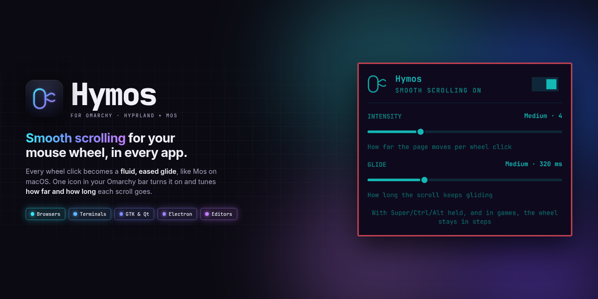
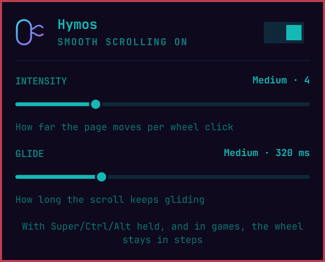
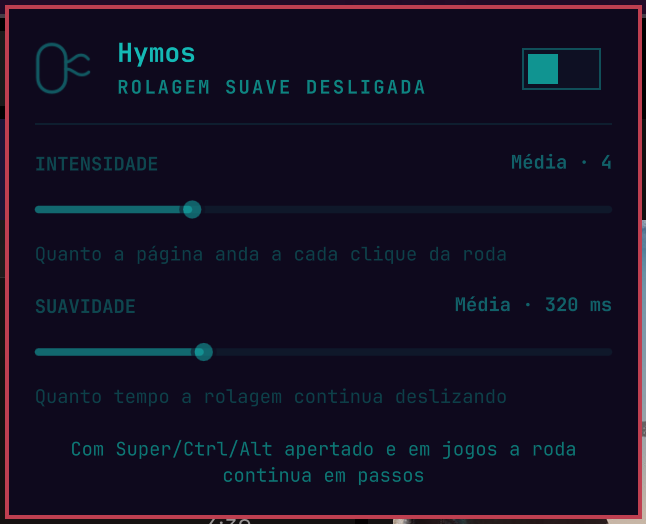

<p align="center">
  
</p>

<p align="center">
  <a href="https://omarchyplugins.com/plugin.html?id=diogocezar.hymos"></a>
  
  <a href="https://hypr.land/"></a>
  <a href="LICENSE"></a>
</p>

<p align="center">
  <a href="#install">Install</a> ·
  <a href="#using-hymos">Using Hymos</a> ·
  <a href="#settings">Settings</a> ·
  <a href="#troubleshooting">Troubleshooting</a> ·
  <a href="#uninstall">Uninstall</a>
</p>

---

**Hymos is a bar widget that makes your mouse wheel scroll smoothly in every
app on Hyprland.** Each wheel click becomes a fluid, eased glide instead of a
jump of a few lines, the way [Mos](https://github.com/Caldis/Mos) does it on
macOS. One icon in your Omarchy bar turns it on and off and tunes how far and
how long each scroll glides.

The smoothing happens inside Hyprland, not in each app, so browsers,
terminals, GTK and Qt apps, Electron apps and editors all scroll the same way,
with nothing to set up per app. *Hyprland + Mos = Hymos.*

<table>
  <tr>
    <td align="center" width="50%"></td>
    <td align="center" width="50%"></td>
  </tr>
  <tr>
    <td align="center"><b>On</b>: tune intensity and glide</td>
    <td align="center"><b>Off</b>, in Portuguese: the wheel is back to steps</td>
  </tr>
</table>

## Features

| | |
|---|---|
| 🧈 **Smooth everywhere** | Browsers, terminals, GTK/Qt, Electron and editors all glide, because Hyprland itself does the smoothing. |
| 📉 **Eased like Mos** | Scrolling starts fast and settles gently. Another flick adds to the glide; reversing direction stops it at once. |
| 🎚️ **Two simple knobs** | **Intensity**: how far the page moves per wheel click. **Glide**: how long it keeps sliding after you stop. |
| ⌨️ **Binds keep working** | With **Super / Ctrl / Alt** held the wheel stays in steps, so `Super + wheel` still switches workspaces. |
| 🎮 **Games left alone** | Steam games, gamescope and RetroArch get the normal stepped wheel, so weapon switching behaves. |
| 🖐️ **Trackpads untouched** | Only real mouse wheels are smoothed; touchpads already scroll smoothly. |
| 🖱️ **Drag to scroll** | Hold a button and move the mouse to scroll like a touchpad, with an optional fling. Off by default; set which button, how far it moves and whether it flings. |
| 📐 **Per-app profiles** | Override intensity, glide or drag for a window class, so a browser and a game can feel different. |
| 🌊 **Three curves** | **expo**, **linear** or **smooth**, each covering the same distance over the same time. |
| ↔️ **Axis lock** | A diagonal drag commits to one axis instead of stuttering across both. |
| 🔁 **Zero setup** | The Hyprland plugin is compiled for *your* Hyprland on first start, cached, and loaded every time the shell starts. Hyprland updated? Hymos rebuilds itself. |
| 🌍 **Multilingual** | English, Português, Español, Français and Deutsch, following your system locale. |

## Install

Hymos compiles a small Hyprland plugin on your machine, so it needs a C++
compiler first. It takes about a minute, no reboot.

### 1. Check your Hyprland version

```bash
hyprctl version | head -1
```

You need **Hyprland 0.56 or newer** (tested on 0.56.2). Hymos hooks into
Hyprland's internal event bus, which older releases don't have.

### 2. Install the compiler

The Hyprland headers already ship with the `hyprland` package on
Omarchy/Arch. For the compiler and `pkg-config`:

```bash
sudo pacman -S --needed base-devel
```

### 3. Install Hymos

```bash
omarchy plugin add https://github.com/diogocezar/omarchy-hymos.git --enable
```

The Hymos icon ()
lands in the right section of your bar. On this first start it compiles the
Hyprland plugin, which takes a few seconds; after that it loads instantly.
Scroll any page: that's it.

Prefer it somewhere else? Move it with:

```bash
omarchy bar move diogocezar.hymos --section left     # or center, right
```

> **Requirements at a glance:** Omarchy with the Quattro shell, Hyprland
> 0.56+, and `base-devel` (`g++` and `pkg-config`). No root is needed after
> that, and Hymos installs nothing else on your system.

## Using Hymos

**Click** the icon to open the panel.

1. Flip the **switch** at the top to turn smooth scrolling on or off.
2. Drag **Intensity** to change how far the page moves per wheel click.
3. Drag **Glide** to change how long the scroll keeps sliding after you stop.

Changes apply as soon as you let go of a slider.

| Shortcut | What it does |
|---|---|
| **Middle-click** the icon | Smooth scrolling on / off, without opening the panel |
| `←` / `→` in the panel | Less / more intensity |
| `↑` / `↓` in the panel | Longer / shorter glide |
| `Esc` | Close the panel |

The icon dims while Hymos is off and turns **red** when something is wrong;
open the panel to see the error.

## Settings

Everything above is also a widget setting, so you can change it from the bar
settings or with `omarchy bar set`:

| Key | Values | Default | What it does |
|---|---|---|---|
| `enabled` | `true`, `false` | `true` | Smooth scrolling on or off |
| `step` | `1`–`12` | `4` | Intensity: distance per wheel click |
| `duration` | `80`–`900` | `320` | Glide: ms until the scroll settles |
| `language` | `auto`, `en`, `pt`, `es`, `fr`, `de` | `auto` | Panel language (`auto` follows the system locale) |

```bash
omarchy bar set diogocezar.hymos step 6 --json          # numbers and booleans need --json
omarchy bar set diogocezar.hymos language pt
```

## Update

```bash
omarchy plugin update diogocezar.hymos
```

## Uninstall

```bash
omarchy plugin remove diogocezar.hymos
hyprctl plugin unload "$(cat ~/.cache/hymos/loaded)"   # stop smoothing right away
rm -rf ~/.cache/hymos ~/.config/hypr/hymos.conf       # optional: build cache and settings
```

Without the unload, smoothing stops the next time you log in. `base-devel`
stays installed; Hymos never installed it.

## How it works

Hymos has two parts:

1. **A tiny Hyprland plugin** (`src/hyprland/hymos.cpp`). It listens to
   Hyprland's pointer-axis event. When a real mouse wheel event arrives, it
   cancels it and replays the same distance as a series of *continuous*
   axis events on a ~250 Hz timer, following an exponential ease-out curve,
   and ends with an `axis_stop`. To apps it looks like a very precise
   trackpad, so they scroll pixel by pixel instead of line by line.
2. **A bar widget** (`src/Widget.qml`). It stores your settings in the shell
   config and pushes them to the plugin through `src/hymos-apply.sh`, which
   builds the plugin when needed, loads it, and writes
   `~/.config/hypr/hymos.conf`.

### The build

The plugin is compiled into `~/.cache/hymos/<hyprland-commit>-<checksum>/`,
once per Hyprland version and source, and old builds are removed. The build
only uses the system toolchain (`/usr/bin/g++`, `/usr/bin/pkg-config` and the
`.pc` files under `/usr`) in an empty environment, so compiler flags, `PATH`
or `PKG_CONFIG_PATH` overrides in your shell never reach the plugin that gets
loaded into Hyprland.

### Config file and `hyprctl`

The widget manages `~/.config/hypr/hymos.conf` for you, but you can edit it
by hand too:

```ini
enabled = 1
step = 4          # intensity: pixels per wheel unit (1–12 in the panel)
duration = 320    # glide: ms until the scroll settles
curve = expo      # expo | linear | smooth: how a glide spends its distance
exclude = steam_app_*, gamescope, *[Rr]etro[Aa]rch*   # window classes kept discrete

# drag to scroll (this plugin's addition, not upstream)
drag_scroll = 1          # 0 = off, 1 = on
drag_button = right      # left | middle | right
drag_threshold = 4       # px of movement before it counts as a scroll, not a click
drag_ratio = -1.0        # px scrolled per px moved; negative = mobile, positive = grab-and-pull
drag_fling = 1           # keep gliding when you let go
drag_fling_tau = 380     # ms; decay time of that glide, so a flick carries further
drag_fling_min_speed = 0.25  # px/ms you must be moving at to coast at all
drag_fling_max_speed = 4.0   # px/ms ceiling, so a hard flick cannot launch the page
axis_lock = 1        # a drag sticks to the axis it started on
drag_click_suppress = 1   # hold the press back, so a drag never opens a menu
```

### Per-application profiles

`~/.config/hypr/hymos-profiles.conf` overrides any of those per window class,
which is how you get one feel in a browser and another in a game. Every setting
is optional; a profile only lists what it changes, and the first matching glob
wins:

```ini
[profile *chrome*]
step = 4
duration = 300

[profile steam_app_*]
enabled = 0

[profile *code*]
drag_scroll = 0
```

The glob is matched against the window class, with `*` for any run of
characters, `?` for one, and `[abc]` / `[a-z]` for a set. With the cursor over
a window, `hyprctl hymos profile` reports which one matched and what it
resolved to, so a typo in the glob is easy to spot. Profiles live in their own
file because the widget rewrites `hymos.conf` in place.

### Scroll curve

All three curves travel the same total distance over `duration`; only the shape
differs:

- **expo** (default) front-loads the movement, then tails off. Snappy, and the
  long tail is what keeps fast scrolling from stopping dead.
- **linear** moves at a constant speed and then stops. Predictable, with nothing
  left over afterwards.
- **smooth** ramps up, runs fast through the middle, and eases into a stop. The
  gentlest of the three.

A drag's inertia always uses an exponential coast of its own, because that is
what a flick feels like, so the curve applies to the wheel.

### Axis lock

A slightly diagonal drag used to split its distance across both axes, which reads
as a stutter. With `axis_lock = 1` the axis the gesture mostly moved along is
claimed once, when the drag starts, and the other component is dropped. Set it
to `0` to get both axes again.

### Drag to scroll

Hold `drag_button` and move the mouse: the page follows the cursor 1:1, and
letting go while still moving throws it on with inertia, the way a flick coasts
on a touchscreen. It runs inside Hyprland, so it works in every app and needs no
extra permissions.

`drag_ratio` is how far the page moves per pixel of mouse movement. Its **sign
sets the direction** and its **size sets the speed**:

- **Negative (the default)** is the mobile feel. Push the cursor up and the page
  advances, the way it does under a finger on a touchscreen. `-1.0` is 1:1.
- **Positive** is grab-and-pull, where the content sticks to the cursor and
  trails behind it. Useful when you want to hold a page still and rake it around.

So `-2.0` is twice as fast as `-1.0`, and `2.0` is the same speed as `-2.0` in
the opposite direction.

`drag_threshold` is the distance the mouse has to travel before the gesture
becomes a scroll. Everything under it stays a normal click, which is why
clicking a link or opening a right-click menu is unaffected.

The glide is meant to feel like a phone, and that takes three knobs:

- `drag_fling_tau` is the decay time of the coast. A flick at speed `v` travels
  about `v * tau`, so `380` (the default) carries a normal flick noticeably
  further than a short one; raise it for a long lazy throw, lower it for a
  short crisp one. It is deliberately independent of `duration`, which only
  governs the wheel, so tuning wheel smoothness does not change how a flick
  feels.
- `drag_fling_min_speed` is the speed you have to be moving at when you let go.
  Park the pointer for a moment before releasing and it coasts nothing, just as
  a finger that comes to rest before it leaves the glass does.
- `drag_fling_max_speed` caps the flick, so one violent throw cannot send the
  page flying.

The speed is averaged over a short window rather than read off the last mouse
event, because a single sample is far too noisy to set a coast from, and the
coast stops as soon as it has slowed to a crawl instead of riding out the
exponential tail.

One tradeoff is deliberate: neither the press nor the release is cancelled,
because the compositor cannot take an event back once it has been sent, and
swallowing the release left Hyprland's own button bookkeeping out of step with
the device, after which every other button stopped working. The consequence is
that an app can see a click at the end of a drag, so a drag that ends over a
text area may open a context menu. Only the *motion* past the threshold is taken
from the app, so text selection, sliders and window dragging are unaffected.

`Super` / `Ctrl` / `Alt` held, and windows on the `exclude` list, are left
alone, same as the wheel.

`exclude` is a comma-separated list of globs matched against the whole window
class: `*` matches any run of characters, `?` any single one and `[abc]` or
`[a-z]` one of a set. It is deliberately not a regex: the match runs on every
wheel event inside Hyprland, and a glob always finishes in time proportional
to the class and pattern lengths.

Since the plugin runs inside Hyprland, it only accepts `step` from 0.1 to 100,
`duration` from 10 to 10000 and an `exclude` list up to 512 characters, and
only reads the file if it is a regular file under 64 KiB. `hyprctl hymos
reload` reports anything it rejects: a bad value falls back to its default, a
bad file keeps the current settings.

```bash
hyprctl hymos             # show the current settings
hyprctl hymos reload      # re-read the config file
hyprctl hymos toggle      # also: on | off
hyprctl hymos drag        # show the drag state
hyprctl hymos drag on     # also: off | toggle
hyprctl hymos profile     # which profile the window under the cursor matched
hyprctl hymos curve smooth # also: expo | linear | toggle
hyprctl hymos axislock on  # also: off | toggle
hyprctl hymos clicksuppress off  # escape hatch: let drags click and open menus
```

## Troubleshooting

<details>
<summary><b>The icon is red</b></summary>

Open the panel: the reason is shown at the top. The usual ones:

- **`Hymos needs /usr/bin/g++ to build`**: install the compiler,
  [step 2](#2-install-the-compiler).
- **`Hymos needs the Hyprland headers`**: reinstall `hyprland`
  (`sudo pacman -S hyprland`).
- **`Hymos failed to build`**: the compiler output is in
  `~/.cache/hymos/build.log`. Please
  [open an issue](https://github.com/diogocezar/omarchy-hymos/issues) with it
  and your `hyprctl version`.
</details>

<details>
<summary><b>Scrolling is still in steps</b></summary>

Check that the plugin is loaded and on:

```bash
hyprctl plugin list | grep hymos
hyprctl hymos
```

Also check that no modifier key is held, and that the window isn't matched by
the `exclude` list in `~/.config/hypr/hymos.conf`.
</details>

<details>
<summary><b>An app should keep the stepped wheel</b></summary>

Add its window class (from `hyprctl activewindow`) to `exclude` in
`~/.config/hypr/hymos.conf`, then run `hyprctl hymos reload`. For example:

```ini
exclude = steam_app_*, gamescope, *[Rr]etro[Aa]rch*, blender
```
</details>

<details>
<summary><b>After a Hyprland update</b></summary>

Log out and back in after updating Hyprland, so the new version is the one
running. Hymos then rebuilds itself for it on the next start, which takes a
few seconds. A *"Built for a different Hyprland version"* notification means
the running Hyprland and the installed headers don't match yet; logging out
and back in fixes it.
</details>

## Credits

Inspired by [Mos](https://github.com/Caldis/Mos) by Caldis, the smooth
scrolling utility that makes mouse wheels a joy on macOS. Hymos is an
independent project and isn't affiliated with Mos or Hyprland.

## License

[MIT](LICENSE) © Diogo Cezar
