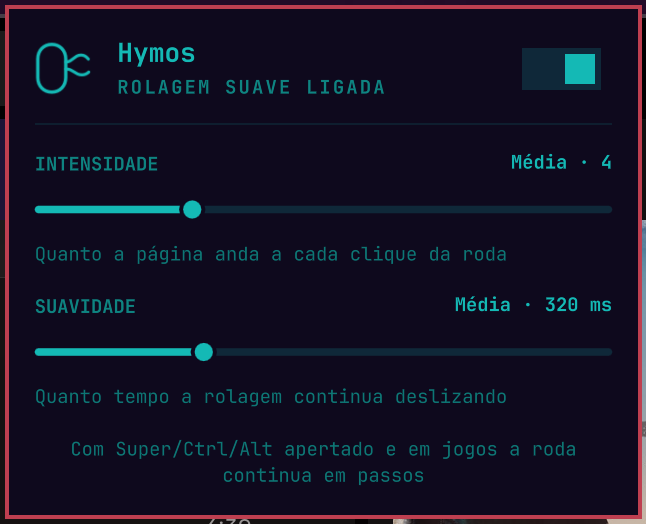

<p align="center">
  
</p>

<p align="center">
  <b>Buttery-smooth mouse-wheel scrolling for Hyprland, right from your Omarchy bar.</b><br>
  <sub>Hyprland + <a href="https://mos.caldis.me/">Mos</a> = Hymos</sub>
</p>

---

Your mouse wheel moves in clunky steps: each click jumps the page a few
lines. On macOS, [Mos](https://github.com/Caldis/Mos) turns those clicks into
the smooth, eased glide you get from a trackpad. **Hymos brings that feeling
to Hyprland.** Every wheel click becomes a stream of tiny pixel-precise scroll
events with an exponential ease-out, in every app, with nothing to configure
per app.

It lives in your Omarchy bar: one click opens a native panel where you switch
it on or off and tune how far and how long each scroll glides.

<p align="center">
  
</p>

## Features

- **Smooth everywhere.** Browsers, GTK/Qt apps, Electron and terminals all
  scroll smoothly, because the smoothing happens in Hyprland itself, not
  inside each app.
- **Eased glide, like Mos.** Scrolling starts fast and settles gently.
  Flicking the wheel again adds to the glide; reversing direction stops it
  instantly.
- **Two simple knobs.**
  - **Intensity** sets how far the page moves per wheel click.
  - **Glide** sets how long the scroll keeps sliding after you stop.
- **Stays out of the way.**
  - With **Super / Ctrl / Alt** held, the wheel stays discrete, so binds like
    `Super + wheel` to switch workspaces keep working.
  - **Games** (Steam, gamescope, RetroArch) get the normal stepped wheel, so
    weapon switching and the like behave.
- **Trackpads untouched.** Only mouse wheels are smoothed; touchpads already
  scroll smoothly.
- **Native Omarchy panel.** Built on the shell's own panel kit, so it follows
  your theme. It's keyboard-friendly: `←/→` changes intensity, `↑/↓` changes
  glide, `Esc` closes. **Middle-click** the bar icon to toggle Hymos without
  opening the panel.
- **Zero setup.** The Hyprland plugin is compiled for *your* Hyprland on first
  run, cached, and loaded automatically every time the shell starts.
  Hyprland updated? Hymos rebuilds itself.
- **Multilingual.** English, Português, Español, Français and Deutsch. It
  follows your system locale, or you can pick a language in the widget
  settings.

<p align="center">
  
  &nbsp;
  
</p>

## Install

```bash
omarchy plugin add https://github.com/diogocezar/omarchy-hymos.git --enable
```

The icon lands in the right section of the bar
(). Move it with
`omarchy bar move diogocezar.hymos --section <left|center|right>`.

The first time it starts, Hymos compiles its Hyprland plugin, which takes
about 20 seconds. After that it loads instantly.

### Requirements

- **Hyprland 0.56 or newer** (tested on 0.56.2). Hymos hooks into Hyprland's
  internal event bus, which older releases don't have.
- **A C++ toolchain and the Hyprland headers**, to build the plugin. On
  Omarchy/Arch the headers ship with the `hyprland` package; for the compiler:

  ```bash
  sudo pacman -S --needed base-devel
  ```

If the build fails, the bar icon turns red and the panel tells you why. The
compiler output is in `~/.cache/hymos/build.log`.

## Update

```bash
omarchy plugin update diogocezar.hymos
```

## Uninstall

```bash
omarchy plugin remove diogocezar.hymos
hyprctl plugin unload "$(cat ~/.cache/hymos/loaded)"   # stop smoothing right away
rm -rf ~/.cache/hymos ~/.config/hypr/hymos.conf       # optional: remove the build cache and settings
```

## How it works

Hymos has two parts:

1. **A tiny Hyprland plugin** (`src/hyprland/hymos.cpp`). It listens to
   Hyprland's pointer-axis event. When a real mouse wheel event arrives, it
   cancels it and replays the same distance as a series of *continuous*
   axis events on a ~250 Hz timer, following an exponential ease-out curve,
   and ends with an `axis_stop`. To apps it looks like a very precise
   trackpad, so they scroll pixel by pixel instead of line by line.
2. **An Omarchy bar widget** (`src/Widget.qml`). It stores your settings in
   the shell config and pushes them to the plugin through
   `src/hymos-apply.sh`. That script builds the plugin once per
   Hyprland version, loads it, and writes `~/.config/hypr/hymos.conf`.

### Config file and `hyprctl`

The widget manages `~/.config/hypr/hymos.conf` for you, but you can edit it
by hand too:

```ini
enabled = 1
step = 4          # intensity: pixels per wheel unit (1–12 in the panel)
duration = 320    # glide: ms until the scroll settles
exclude = ^(steam_app_.*|gamescope|.*[Rr]etro[Aa]rch.*)$   # window classes kept discrete
```

```bash
hyprctl hymos             # show the current settings
hyprctl hymos reload      # re-read the config file
hyprctl hymos toggle      # also: on | off
```

## Credits

Inspired by [Mos](https://github.com/Caldis/Mos) by Caldis, the smooth
scrolling utility that makes mouse wheels a joy on macOS. Hymos is an
independent project and is not affiliated with Mos or Hyprland.

## License

[MIT](LICENSE) © Diogo Cezar
